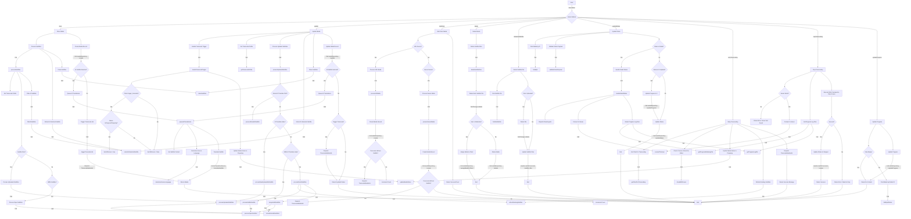

```mermaid
graph TD
    %% Start
    A[Start] -->|User Action| B{Select Method}

    %% Main Methods Selection
    B -->|store| C[Store Media]
    B -->|update| D[Update Media]
    B -->|bulkStore| E[Bulk Store Media]
    B -->|delete| F[Delete Media]
    B -->|deleteSubtitleFile| G[Delete Subtitle File]
    B -->|updateStatus| H[Update Status]
    B -->|retryTranscoding| I[Retry Transcoding]
    B -->|stopTranscoding| J[Stop Transcoding]
    B -->|updateProgress| K[Update Progress]

    %% Store Media Flow
    C --> C1[Process Subtitles]
    C1 -->|Call| P[processSubtitles]
    P --> P1[Get Transcode Profile]
    P --> P2{Subtitle Files?}
    P2 -->|Yes| P3[Process Uploaded Subtitles]
    P3 -->|Call| Q[processUploadedSubtitles]
    P2 -->|No| P4{IMDb Subtitles?}
    P4 -->|Yes| P5[Process Open Subtitles]
    P5 -->|Call| R[processOpenSubtitles]
    P --> P6[Filter AI Subtitles]
    P6 -->|Call| S[filterAiSubtitles]
    S -->|Call| T[extractAiSelectedSubtitle]
    C1 --> C2[Extract AI Selected Subtitle]
    C2 -->|Call| T
    C1 --> C3[Clean Subtitles]
    C3 -->|Call| U[cleanSubtitles]
    C --> C4[Create Media Record]
    C4 -->|Call mediaRepository->create| C5{AI Subtitle Selected?}
    C5 -->|Yes| C6[Queue AI Translations]
    C6 -->|Call| V[queueAiTranslations]
    V --> V1[Get Subtitle Content]
    V --> V2[Determine Source Language]
    V2 -->|Call| W[determineSourceLanguage]
    V --> V3[Translate Subtitle]
    V3 -->|Call aiTranslationService->translateSubtitle| C7[Return Media]
    C5 -->|No| C8[Trigger Transcode Job]
    C8 -->|Call| X[triggerTranscodeJob]
    X -->|Dispatch TranscodeMediaJob| C7

    %% Update Media Flow
    D --> D1[Handle Transcode Trigger]
    D1 -->|Call| Y[handleTranscodeTrigger]
    Y --> Y1{Check trigger_transcode?}
    Y1 -->|Yes| Y2{Status InProgress/Preparing?}
    Y2 -->|Yes| Y3[Set killScreen = true]
    Y2 -->|No| Y4[Set killScreen = false]
    Y1 -->|No| Y4
    Y --> Y5[Update Media Status to Preparing]
    Y5 -->|Call| Z[updateMediaStatus]
    D --> D2[Get Transcode Profile]
    D2 -->|Call| AA[getTranscodeProfile]
    D --> D3[Process Updated Subtitles]
    D3 -->|Call| AB[processUpdatedSubtitles]
    AB --> AB1{Stored AI Translate Path?}
    AB1 -->|Yes| AC[processStoredAiSubtitle]
    AB1 -->|No| AB2{AI Translate Index?}
    AB2 -->|Yes| AD[processNewUploadedAiSubtitle]
    AD -->|Call| Q
    AB2 -->|No| AB3{IMDb AI Translate Index?}
    AB3 -->|Yes| AE[processImdbAiSubtitle]
    AE -->|Call| AF[normalizeImdbSubtitles]
    AE -->|Call| R
    AB3 -->|No| AG[processNonAiSubtitles]
    AG -->|Call| AH[refreshExistingSubtitles]
    AG -->|Call| Q
    AG -->|Call| AI[mergeImdbSubtitles]
    AI -->|Call| AF
    AI -->|Call| R
    D --> D4[Extract AI Selected Subtitle]
    D4 -->|Call| T
    D --> D5[Clean Subtitles]
    D5 -->|Call| U
    D --> D6[Update Media Record]
    D6 -->|Call mediaRepository->update| D7{AI Subtitle Selected?}
    D7 -->|Yes| D8[Queue AI Translations]
    D8 -->|Call| V
    D7 -->|No| D9{Trigger Transcode?}
    D9 -->|Yes| D10[Dispatch TranscodeMediaJob]
    D10 --> D11[Return Updated Status]
    D9 -->|No| D11

    %% Bulk Store Media Flow
    E --> E1{URL Source?}
    E1 -->|Yes| E2[Process URL Media]
    E2 -->|Call| AJ[processUrlMedia]
    AJ --> AJ1[Create Media Record]
    AJ1 -->|Call mediaRepository->create| AJ2{Transcode Without Subtitle?}
    AJ2 -->|Yes| AJ3[Dispatch TranscodeMediaJob]
    AJ2 -->|No| AJ4[Increment Count]
    E1 -->|No| E3{Server Source?}
    E3 -->|Yes| E4[Process Server Media]
    E4 -->|Call| AK[processServerMedia]
    AK --> AK1[Create Media Record]
    AK1 -->|Call mediaRepository->create| AK2{Transcode Without Subtitle?}
    AK2 -->|Yes| AK3[Dispatch TranscodeMediaJob]
    AK2 -->|No| AK4[Increment Count]
    E --> E5[Return Success/Count]

    %% Delete Media Flow
    F --> F1[Delete Subtitle Files]
    F1 -->|Call| AL[deleteSubtitleFiles]
    AL --> AL1[Delete Each Subtitle File]
    AL1 -->|Call Storage->delete| F2{User is Moderator?}
    F2 -->|Yes| F3[Assign Media to Client]
    F3 -->|Call mediaRepository->assignMediaToClient| F4[End]
    F2 -->|No| F5[Delete Media]
    F5 -->|Call mediaRepository->delete| F4

    %% Delete Subtitle File Flow
    G --> G1[Find Subtitle File]
    G1 -->|Call| AM[findSubtitleFile]
    G --> G2{File is Uploaded?}
    G2 -->|Yes| G3[Delete File]
    G3 -->|Call Storage->delete| G4[Update Subtitle Files]
    G2 -->|No| G4
    G4 -->|Update mediaTranscode->subtitle_files| G5[End]

    %% Update Status Flow
    H --> H1[Find Media by ID]
    H1 -->|Call| findById
    H --> H2[Validate Status Payload]
    H2 -->|Call| AN[validateStatusPayload]
    H --> H3{Status is Failed?}
    H3 -->|Yes| H4[Handle Failed Status]
    H4 -->|Call| AO[handleFailedStatus]
    AO --> AO1[Dispatch ReadLogJob]
    AO --> AO2[Connect to Server]
    AO2 -->|Call| AP[connectToServer]
    AO --> AO3[Delete Progress Log Files]
    AO3 -->|Call| AQ[getProgressMediaLogFile]
    AO3 -->|Call| AR[getProgressLogFile]
    H3 -->|No| H5{Status is Completed?}
    H5 -->|Yes| H6[Update Progress to 0]
    H6 -->|Call mediaRepository->updateProgress| H7[Update Status]
    H5 -->|No| H7
    H7 -->|Call mediaRepository->updateStatus| H8[End]

    %% Retry Transcoding Flow
    I --> I1[Get Client for Transcoding]
    I1 -->|Call| AS[getClientForTranscoding]
    I --> I2[Check if Screen Should be Killed]
    I2 -->|Call| AT[shouldKillScreen]
    I --> I3[Update Media Status to Preparing]
    I3 -->|Call| Z
    I --> I4[Refresh Existing Subtitles]
    I4 -->|Call| AH
    I --> I5[Dispatch TranscodeMediaJob]
    I5 --> I6[Return Success Message]

    %% Stop Transcoding Flow
    J --> J1{Server Exists?}
    J1 -->|No| J2[Return Error: Server Not Found]
    J1 -->|Yes| J3[Connect to Server]
    J3 -->|Call| AP
    J --> J4[Get Progress Log Files]
    J4 -->|Call| AQ
    J4 -->|Call| AR
    J --> J5[Execute SSH Command to Stop Screen]
    J5 --> J6{Success?}
    J6 -->|Yes| J7[Update Status to Stopped]
    J7 -->|Update mediaTranscode->status| J8[Return Success]
    J6 -->|No| J9[Return Error: Failed to Stop]

    %% Update Progress Flow
    K --> K1{Data Empty?}
    K1 -->|Yes| K2[Return No Content]
    K1 -->|No| K3[Find Media by Global ID]
    K3 -->|Call| findByIdGlobal
    K --> K4[Update Progress]
    K4 -->|Call mediaRepository->updateProgress| K2

    %% End
    C7 --> A1[End]
    D11 --> A1
    E5 --> A1
    F4 --> A1
    G5 --> A1
    H8 --> A1
    I6 --> A1
    J8 --> A1
    J9 --> A1
    K2 --> A1
```
